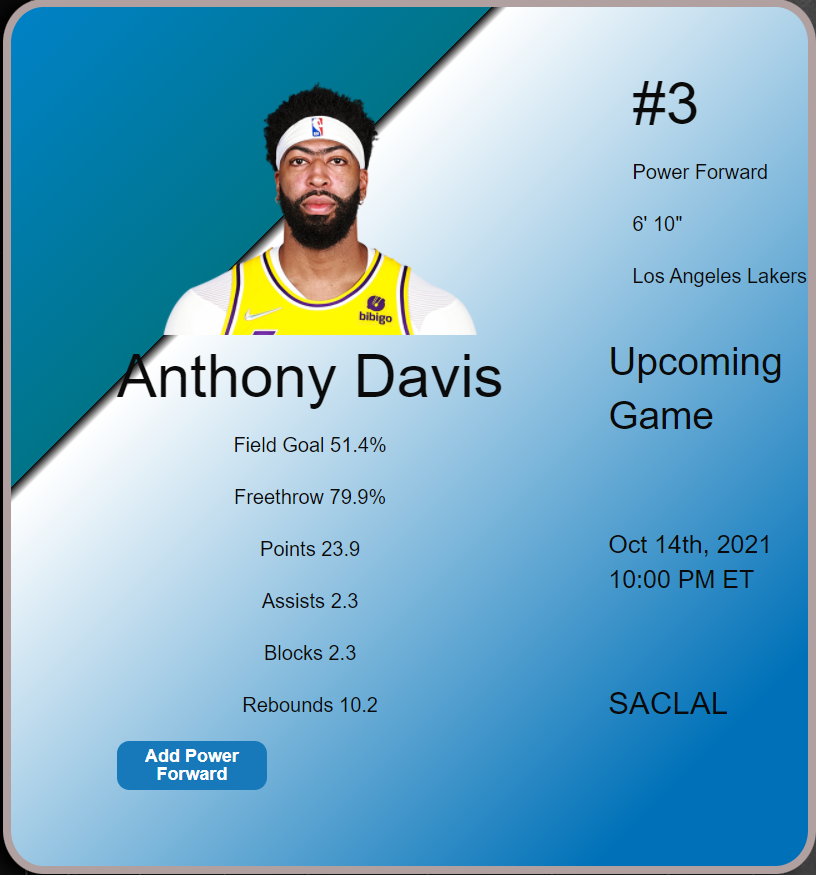
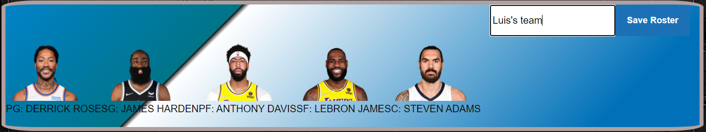

# WELCOME TO ALL-STAR TEAM DRAFT!

This is all about finding your favorite Basketball team. Over here, we will make your Dream Team factual. 


___


The API's that we used:

* [API ONE](https://data.nba.net/10s/prod/v2/2021/teams.json)
* [API TWO](http://data.nba.net/10s/prod/v1/2021/teams/hawks/schedule.json)


## Index Section 


> have **About us** , **Contact Us** & **NBA API Links**


## Title and description

> this part has a class container welcoming our **All-Star Team Draft** and the rules to make your team happen in real time!


## Search Cards

> Individuals can write their players name and can select for their all stars if they want to! 

>In the player card two API's been used.

```js
NBA team API Documentation Retrive players name along with their recent picture and other stats such as their assists, Field goals etc.
```

```js
NBA Player Individual Stats API Documentation Retrive players that has been called by User input. This API is an intensive NBA Player API offering complete accounts for all active NBA player games and show the stats right side of the player card.
```

___
here is a demo player card screenshot.


## User team

**congratulations!**

> Selected players would fit in their general positions. 

> You can now add your teams name and **HORREYY!!** there it is, your very own All-STAR Draft TEAM!
___


## Inquaries 

> For twitter, facebook and github support, feel free to like and comment in our pages.

>User can provide us with their **Email**'s so that we can contact with you later for business purposes. 


**thank you for your support and love.**
